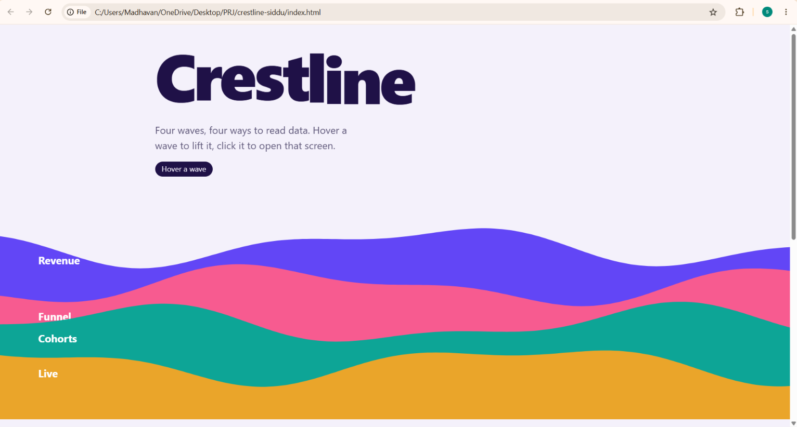
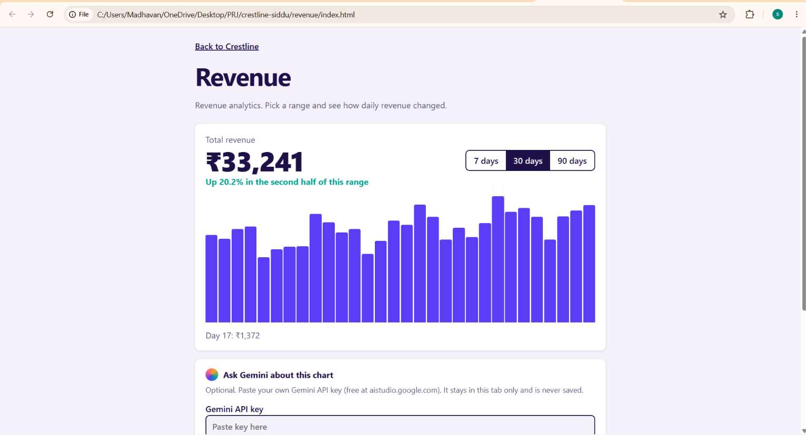
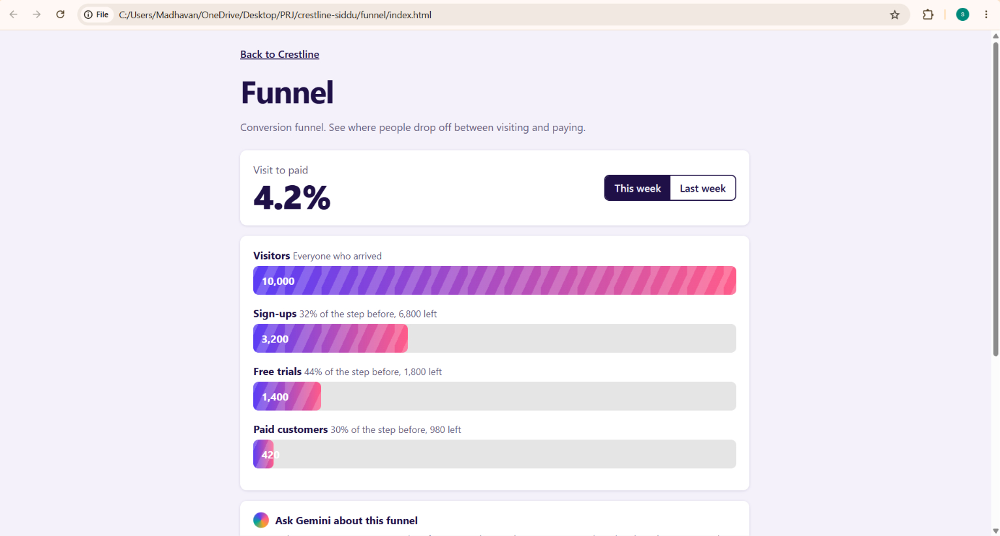
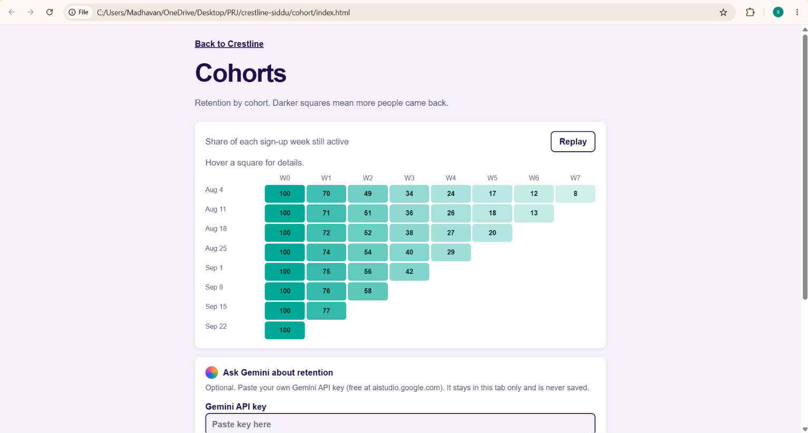
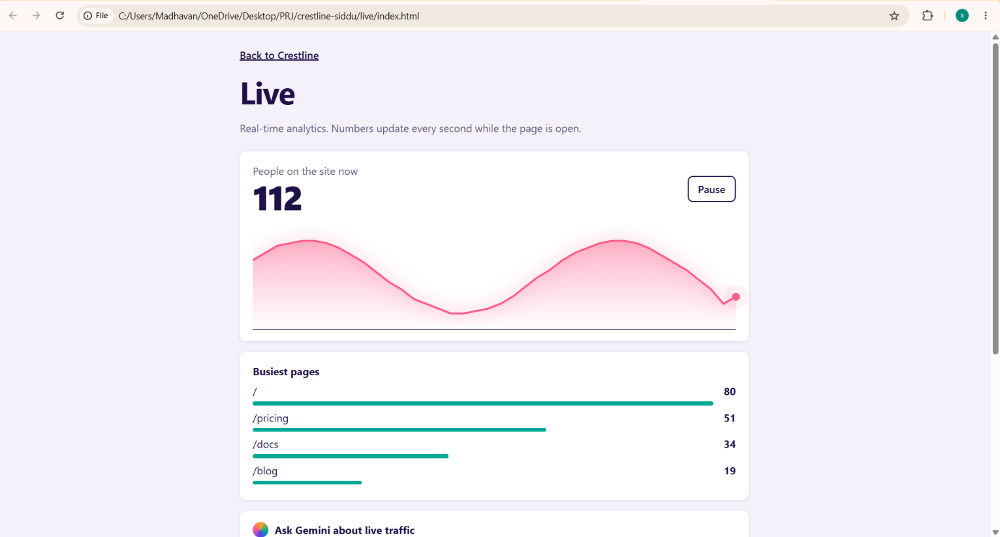

# Crestline

Four analytics screens, each reached through a layered-wave navigation hub.

## Team
- Team name: Crestline
- Members: madhav1-007 and siddupati4-hue (2 members)

## Selected UI topic
Analytics & Data Visualization: Revenue Analytics, Conversion Funnel,
Retention & Cohort Analytics and Real-time Analytics, with an AI
"Ask Your Data" box powered by Google Gemini.

## Topic research
- **What the pattern is:** An analytics dashboard turns raw numbers into charts so people can understand them quickly.
- **Where it is commonly used:** Business tools, marketing platforms, finance apps and product analytics.
- **Why it matters for modern web interfaces:** Most software now has a dashboard, and good charts help users decide faster.
- **Patterns observed:** Cards with big numbers, charts that react on hover, filters and colour to show trends.
- **What we do differently:** a layered-wave navigation hub where each wave opens one screen, plus a Gemini question box on every screen.

## Implemented UIs
| Screen | Folder |
|---|---|
| Revenue | `revenue/` |
| Funnel | `funnel/` |
| Cohort | `cohort/` |
| Live | `live/` |

## Technologies used
HTML, CSS, JavaScript, Google Gemini API

## Screenshots

## How to run
1. Download or clone the repository.
2. Open `index.html` in a browser.
3. Live site: https://madhav1-007.github.io/crestline/
4. For the Gemini boxes, paste your own Gemini API key into the page. Never save it in a file.

## GitHub workflow
Fork, clone, branch, commit, push, pull request, review, merge. See the Pull requests tab for the full history.